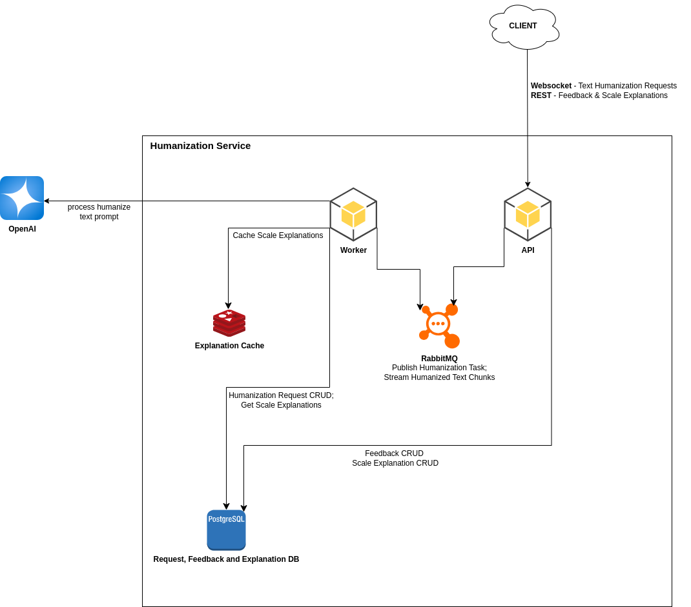
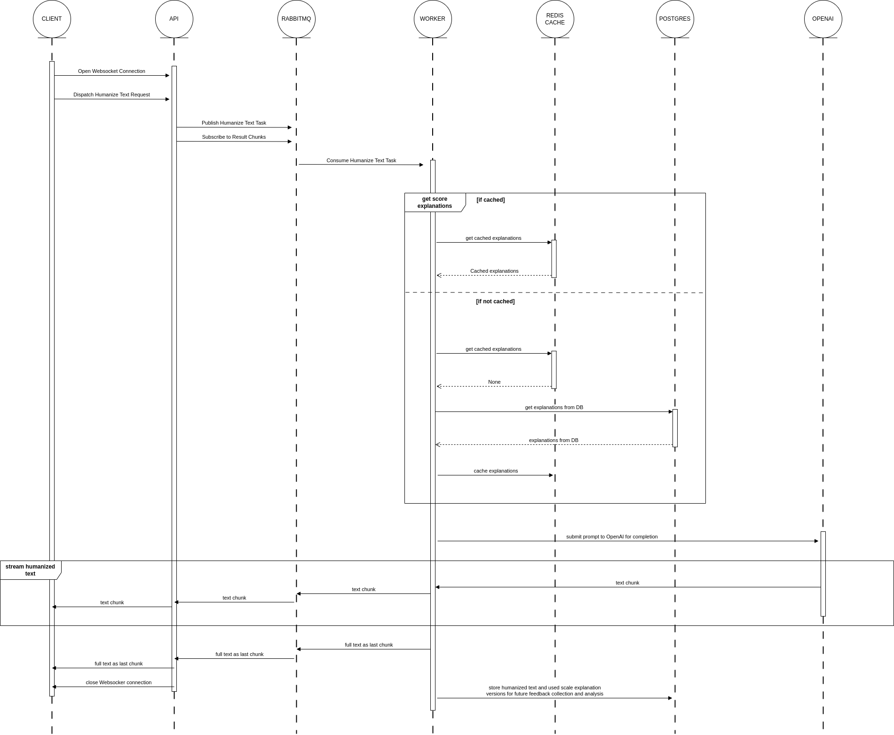

# Humanization Service

## Overview
The **Humanization Service** is a scalable and modular API designed to transform AI-generated text into more natural, human-like language based on configurable parameters. It utilizes **FastAPI** for the API service, **RabbitMQ** for asynchronous processing, and **PostgreSQL** for data storage. The service leverages **Redis** for caching and **OpenAI's API** for text transformation.

## Diagrams

### System Architecture


### Humanization Flow



## Features
- **Real-time Text Humanization**: Processes text to appear more natural and human-like.
- **Configurable Parameters**: Adjusts levels of casualness, humor, conciseness, typos, grammatical imperfections, and more.
- **WebSocket Support**: Enables real-time text streaming.
- **RabbitMQ Queue Processing**: Decouples API from processing logic for better scalability.
- **Feedback System**: Collects user ratings for continuous improvements.
- **Dockerized Deployment**: Easily deployable with Docker and Docker Compose.
- **Redis Caching**: Stores explanation versions for rapid access.

---

## Architecture

### Components
1. **API Service** - Exposes endpoints for text humanization and feedback submission.
2. **Worker Service** - Asynchronously processes text transformation tasks.
3. **RabbitMQ** - Handles job queueing for efficient asynchronous processing.
4. **PostgreSQL** - Stores transformation requests, responses, and feedback.
5. **Redis** - Caches explanation versions for reduced DB load.

### Folder Structure
```
backend/
├── api/                  # FastAPI application
│   ├── controller/       # API route handlers
│   │   ├── humanization_controller.py
│   │   ├── feedback_controller.py
│   │   ├── management_controller.py
│   ├── main.py           # FastAPI entry point
│
├── worker/               # RabbitMQ consumer (worker)
│   ├── humanization_worker.py
│
├── database/             # PostgreSQL setup and migrations
│   ├── model/            # ORM models
│   ├── repository/       # Database operations
│   ├── migrations/       # Alembic migration scripts
│   ├── database_service.py # Connection management
│
├── message_queue/        # RabbitMQ queueing
│   ├── messages/         # Message definitions
│   ├── message_queue_service.py
│
├── services/             # Business logic layer
│   ├── humanization_service.py
│   ├── feedback_service.py
│   ├── explanation_service.py
│
├── cache/                # Redis caching
│   ├── cache_service.py
│
├── core/                 # Config & logging
│   ├── config.py
│
├── tests/                # Unit & integration tests
│
├── Dockerfile            # Docker setup
├── docker-compose.yml    # Container orchestration
```

---

## System Workflow
1. **User sends a request** to the API with text and humanization parameters.
2. **API publishes a task** to RabbitMQ.
3. **Worker service consumes the task** and processes text using OpenAI API.
4. **Worker sends back the humanized text** via RabbitMQ.
5. **API returns the transformed text** to the user.
6. **Users can submit feedback**, stored in PostgreSQL.

---

## Technologies Used
| Technology  | Purpose |
|-------------|---------|
| **FastAPI** | API framework |
| **RabbitMQ** | Asynchronous task processing |
| **PostgreSQL** | Persistent storage |
| **Redis** | Caching explanation versions |
| **OpenAI API** | Text transformation |
| **Docker & Docker Compose** | Deployment |
| **Alembic** | Database migrations |

---

## Setup and Deployment
### **Requirements**
- Python 3.10+
- Docker & Docker Compose
- PostgreSQL
- RabbitMQ
- Redis

### **Running the Service**
#### **1. Clone the Repository**
```bash
git clone https://github.com/your-username/humanization-service.git
cd humanization-service
```

#### **2. Set Up Environment Variables**
Create `.env` files for API, worker, RabbitMQ, and PostgreSQL using the provided examples (`api.env`, `worker.env`, etc.).

#### **3. Build and Run with Docker Compose**
```bash
docker-compose up --build
```
This will start all required services: API, worker, RabbitMQ, PostgreSQL, and Redis.

#### **4. Verify Running Services**
- API available at: `http://localhost:8000/docs`
- RabbitMQ Management UI: `http://localhost:15672` (user: guest, password: guest)
- PostgreSQL at: `localhost:5432`
- Redis at: `localhost:6379`

#### **5. Run Database Migrations**
```bash
docker-compose exec api python database/run_alembic_migrations.py
```

---

## API Endpoints
| Method | Endpoint | Description |
|--------|---------|-------------|
| **POST** | `/humanize` | Process text humanization |
| **POST** | `/feedback` | Submit user feedback |
| **POST** | `/management/explanations` | Manage explanation versions |

---

## Test functionality with Postman
Establish a connection at ws://localhost:8000/humanize/ws, and send a JSON body with the following parameters:

```json
{
    "request_id": 123456789,
    "original_text": "This is the original text. This text is pretty nice. It is also very robotic.",
    "parameters": {
        "casualness": 5,
        "humor": 5,
        "conciseness": 5,
        "punctuation_errors": 5,
        "typos": 8,
        "grammatical_imperfections": 8,
        "redundancy": 8,
        "informal_contractions": 5
    },
    "parameter_explanation_versions": {},
    "model_name": "gpt-3.5-turbo"
}
```
The response will be a stream of text chunks, and the final chunk will have a flag "isLast" and will carry the concatenated final text, after which the server will close the connection.

Output example:
```json
{"isLast": false, "text_piece": "This", "final_text": ""}
{"isLast": false, "text_piece": " is", "final_text": ""}
{"isLast": false, "text_piece": " like", "final_text": ""}
{"isLast": false, "text_piece": " the", "final_text": ""}
{"isLast": false, "text_piece": " OG", "final_text": ""}
{"isLast": false, "text_piece": " text", "final_text": ""}
{"isLast": false, "text_piece": ".", "final_text": ""}
{"isLast": false, "text_piece": " This", "final_text": ""}
{"isLast": false, "text_piece": " text", "final_text": ""}
{"isLast": false, "text_piece": " is", "final_text": ""}
{"isLast": false, "text_piece": " pretty", "final_text": ""}
{"isLast": false, "text_piece": " cool", "final_text": ""}
{"isLast": false, "text_piece": ".", "final_text": ""}
{"isLast": false, "text_piece": " It", "final_text": ""}
{"isLast": false, "text_piece": "'s", "final_text": ""}
{"isLast": false, "text_piece": " also", "final_text": ""}
{"isLast": false, "text_piece": " super", "final_text": ""}
{"isLast": false, "text_piece": " robotic", "final_text": ""}
{"isLast": false, "text_piece": ".", "final_text": ""}
{"isLast": true, "text_piece": "", "final_text": "This is like the OG text. This text is pretty cool. It's also super robotic."}
```

---

## Main flows of the service

### Humanization flow
This flow is to send the original text to the humanization service, together with parameters, and get the humanized text back.
1. A websocket connection is established with the server.
2. The client sends a JSON with the following parameters:
    - request_id: The id of the request.
    - original_text: The text to be humanized.
    - parameters: The parameters for the humanization.
    - parameter_explanation_versions: The explanation versions for the parameters.
    - model_name: The name of the model to use.
3. The controller creates a task and publishes it to the RabbitMQ. It then subscribes to the response queue, ready to stream the response chunks back to the client.
4. The worker service consumes the task from the RabbitMQ, and processes it by going through the following steps:
    - Fetching the explanation texts for the parameters from the cache or the database.
    - Building the system prompt from the explanations and the parameters.
    - Calling the OpenAI API to get the humanized text.
    - Streaming the humanized text chunks to the client.
    - Concatenating the final response and storing in DB (this is necessary for feedback collection).
5. The client concatenates the chunks and displays the final text.

### Feedback flow
This flow is to collect feedback from the user about the humanized text.
1. User submits feedback data to the `/feedback` endpoint. The user selects a score between -2 and 2, where -2 is "Most definitely AI-generated", and 2 is "Most definitely human-written".
2. Feedback data is stored in the database for future reference.

### Explanation flow
Scale explanations must be stored in the database, as opposed to being directly in-code. This is necessary to keep track of explanation changes and how it affects feedback from the users. If the humanization is delegated to OpenAI, we must control what is on our end - the prompts. The quality of prompt instructions, as well as the chosen model, is what determines the quality of the humanized text. At the moment only the model and explanation versions are being tracked, but the other text also found in the prompt should also be versioned in a similar fashion (TO DO).

In order to use a score, the managing person should only add an explanation for it, and a new type of score could be used.
To add an explanation, or another version, the managing person should use the endpoint `POST /management/explanations` to create a new explanation, or another version of an existing score explanation.

When a humanization request is being made, by default the LATEST explanation version will be used, unless specified in field "parameter_explanation_versions" for the exact version. This could be useful to do A/B testing of different explanations to see which one results in better user feedback.

---

## Scalability Considerations
- **Asynchronous Processing**: RabbitMQ ensures API responsiveness.
- **Caching**: Redis reduces database load for explanation queries.
- **Feedback Integration**: Improves models based on user ratings. (Functionality to collect feedback is implemented; to be used by Data Analysts)
- **Database Optimization**: Old records are periodically pruned. (Not implemented)
